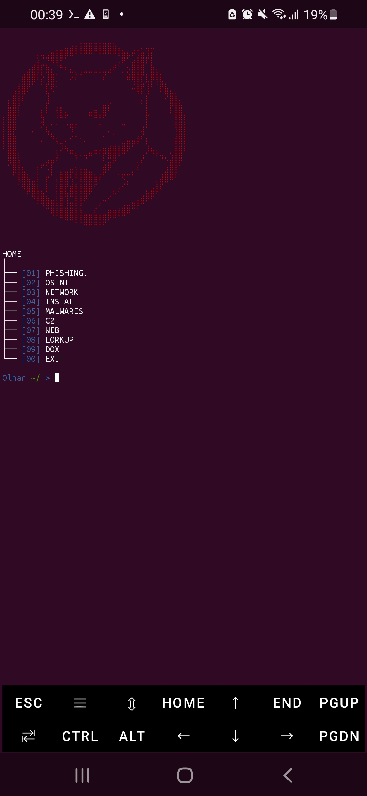
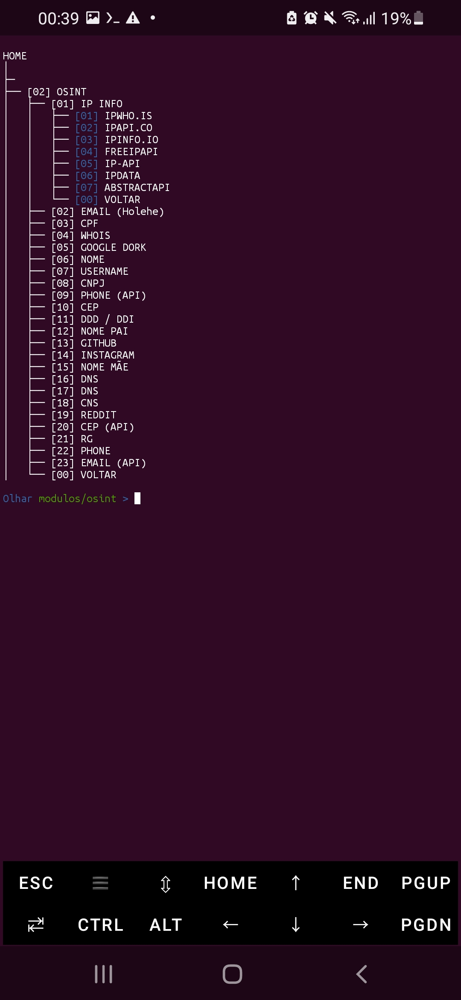
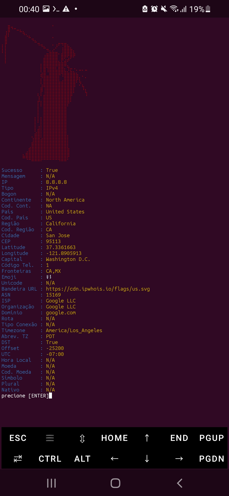

# MainTools

MainTools é uma toolkit desenvolvida em Python que reúne diversas ferramentas em uma única interface de terminal.

O projeto foi criado para facilitar estudos, desenvolvimento e organização de ferramentas relacionadas à segurança da informação, redes, desenvolvimento e automação.

---

## Recursos

- OSINT
- Ferramentas Web
- Google Dorks
- WHOIS
- Consulta de IP
- Consulta de CEP
- Enumeração de Diretórios
- Ferramentas de Rede
- Utilitários diversos

---

## Capturas de Tela

### Menu Principal



### Exemplo



### Exemplo de Uso



---

## Instalação

Clone o repositório:

```bash
git clone https://github.com/ErikAndGabriel/Manin_tools 
```

Entre na pasta do projeto:

```bash
cd Manin_tools
```

Instale as dependências:

```bash
pip install -r requirements.txt
```

Execute o programa:

```bash
python MainTools.py
```

---

## Estrutura do Projeto

```text
MainTools/
│
├── config/
├── controllers/
├── core/
├── data/
├── modulos/
├── ui/
├── FOTOS/
│   ├── menu_inicial.jpg
│   ├── exemplo.jpg
│   └── exemplo_uso.jpg
├── MainTools.py
├── requirements.txt
└── README.md
```

---

## Requisitos

- Python 3.10 ou superior
- Sistema Linux ou Termux
- Dependências presentes em `requirements.txt`

---

## Objetivo

O MainTools busca reunir diversas ferramentas em um único projeto, oferecendo uma interface simples e organizada para facilitar estudos e desenvolvimento de novas funcionalidades.

---

## Aviso

Este projeto foi desenvolvido exclusivamente para fins educacionais e testes autorizados.

O autor não se responsabiliza pelo uso inadequado da ferramenta.

---

## Licença

Este projeto está distribuído sob a licença MIT.
